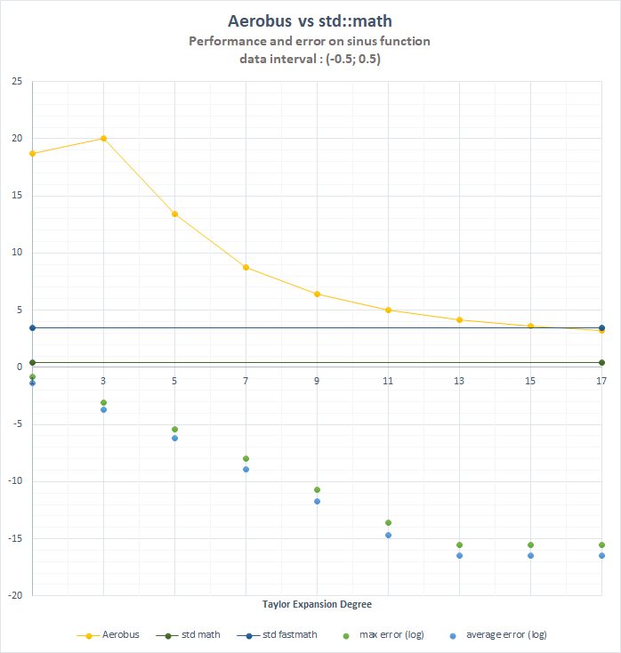

# Summary

C++ comes with high compile-time computations capability, also known as metaprogramming with templates.
Templates are a language-in-the-language which is Turing-complete, meaning we can run every computation at compile time instead of runtime, as long as input data is known at compile time. 

Using these capabilities, vastly extended with the latest versions of the standard, we implemented a library for discrete Euclidean domains, such as $\mathbb{Z}$. We also provide a way to generate the fraction field of such rings (e.g. $\mathbb{Q}$). 

We also implemented polynomials over such discrete rings and fields (e.g. $\mathbb{Q}[X]$). Since polynomials are also a ring, the above implementation gives us rational fractions as the field of fractions of polynomials.

In addition, we expose a way to generate the Taylor series of any math functions as long as coefficients are known. 

In addition, we added some useful additional features, such as known polynomials (Chebyshev), continued fractions, quotient rings and some Conway polynomials to define Galois finite fields.

`Aerobus` was designed to be used in high-performance software, teaching purposes or embedded software where as much as possible must be precomputed to shrink binary size. It compiles with major compilers: gcc, clang and msvc. It is quite easily configurable and extensible. 

# Statement of need
By implementing general algebra concepts such as discrete rings, field of fractions and polynomials, `Aerobus` can serve multiple purposes. 

The main application we want to express in this paper is the automatic (and configurable) generation or Taylor approximation of usual transcendental functions such as `exp` or `sin`. The "generated" code is pure C++ and can be inspected.

These functions are usually exposed by the standard library (`<cmath>`) with high (guaranteed) precision. However, in high-performance computing, when not compiled with `-Ofast`, evaluating `std::exp` has several flaws: 

- it leads to a `syscall` which is very expensive
- it doesn't leverage vector units (avx, avx2, avx512 or equivalent in non-intel hardware). 

Hardware vendors provide high-performance libraries such as [@wang2014intel], but implementation is often hidden and not extensible. 

Some others can provide vectorized functions, such as [@vml] does. But libraries like VML are highly tight to one architecture by their use of intrinsics or inline assembly. In addition, they only provide a restricted list of math functions and do not expose capabilities to generate high-performance versions of other functions such as arctanh. It is the same for the standard library compiled with `-Ofast`: it generates a vectorized version of some functions (such as exp) but with no control of precision and no extensibility. 

`Aerobus` provides automatic generation of such functions, in a hardware-independent way.
In addition, `Aerobus` provides a way to control the precision of the generated function by changing the degree of Taylor expansion, which can't be used in competing libraries without reimplementing the whole function. 

# Mathematic definitions
For the sake of completeness, we give basic definitions of the mathematical concepts which the library deals with. However, readers desiring complete and rigorous definitions of the concepts explained below should refer to some mathematical books on algebra, such as [@lang2012algebra] or [@bourbaki2013algebra].

A `ring` $\mathbb{A}$ is a nonempty set with two internal laws, addition and multiplication. There is a neutral element for both, zero and one. 
Addition is commutative and associative and every element $x$ has an inverse $-x$. Multiplication is commutative, associative and distributive over addition, meaning that $a(b+c) = ab+ac$ for every $a, b, c$ element. We call it `discrete` if it is countable. 

An `integral domain` is a ring with one additional property. For every elements $a, b, c$ such as $ab = ac$, then either $a = 0$ or $b = c$. Such a ring is not always a field, such as $\mathbb{Z}$ shows it. 

An `euclidean domain` is an integral domain that can be endowed with an euclidean division. 

For such an euclidean domain, we can build two important structures: 

## Polynomials $\mathbb{A}[X]$
Polynomials over $\mathbb{A}$ is the free module generated by a base noted $(X^k)_{k\in\mathbb{N}}$. Practically speaking, it's the set of 

$$a_0 + a_1X + \ldots + a_nX^n$$

where $a_n \neq 0$ if $n \neq 0$. 

$(a_i)$, the coefficients, are elements of $\mathbb{A}$. The theory states that if $\mathbb{A}$ is a field, then $\mathbb{A}X$ is Euclidean. That means notions like division of greatest common divisor (gcd) have a meaning, yielding an arithmetic of polynomials. 


## Field of fractions
If $\mathbb{A}$ is Euclidean, we can build its field of fractions: the smallest field containing $\mathbb{A}$. 
We construct it as congruences classes of $\mathbb{A}\times \mathbb{A}$ for the relation $(p,q) \sim (pp, qq)\  \mathrm{iff}\ p*qq = q*pp$. Basic algebra shows that this is a field (every element has an inverse). The canonical example is $\mathbb{Q}$, the set of rational numbers. 

Given polynomials over a field form an Euclidean ring, we can do the same construction and get rational fractions $P(x) / Q(X)$ where $P$ and $Q$ are polynomials.

## Quotient rings
In an Euclidean domain $\mathbb{A}$, such as $\mathbb{Z}$ or $\mathbb{A}[X]$, we can define the quotient ring of $\mathbb{A}$ by a principal ideal $I$. Given that $I$ is principal, it is generated by an element $X$ and the quotient ring is the ring of rests modulo $X$. When $X$ is `prime` (meaning it has no smallest factors in $\mathbb{A}$), the quotient ring $\mathbb{A}/I$ is a field. 

Applied on $\mathbb{Z}$, that operation gives us modular arithmetic and all finite fields of cardinal $q$ where $q$ is a prime number (up to isomorphism). These fields are usually named $\mathbb{Z}/p\mathbb{Z}$. Applied on $\mathbb{Z}/p\mathbb{Z}[X]$, it gives finite Galois fields, meaning all finite fields of cardinal $p^n$ where $p$ is prime, see [@evariste1846memoire]. 

# Software
All types of `aerobus` have the same structure.

An englobing type describes an algebraic structure. It has a nested type `val` which is always a template model describing elements of the set.

For example, integers: 
```cpp
struct i32 {
		template<int32_t x>
		struct val {};
};
```
This is because we want to operate on types more than on values. This allows generic implementation, for example of gcd (see below) without specifying what are the values. 

## Concepts
The library exposes two main `concepts`: 
```cpp
template <typename R>
concept IsRing = requires {
  typename R::one;
  typename R::zero;
  typename R::template add_t<typename R::one, typename R::one>;
  typename R::template sub_t<typename R::one, typename R::one>;
  typename R::template mul_t<typename R::one, typename R::one>;
};

template <typename R>
concept IsEuclideanDomain = IsRing<R> && requires {
  typename R::template div_t<typename R::one, typename R::one>;
  typename R::template mod_t<typename R::one, typename R::one>;
  typename R::template gcd_t<typename R::one, typename R::one>;
  typename R::template eq_t<typename R::one, typename R::one>;
  typename R::template pos_t<typename R::one>;
  R::is_euclidean_domain == true;
};
```
which express the algebraic objects described above. Then, as long as a type satisfies the IsEuclideanDomain concept, we can calculate the greatest common divisor of two values of this type using Euclide's algorithm. As stated above, this algorithm operates on types instead of values and does not depend on the Ring, making it possible for users to implement another kind of discrete Euclidean domain without worrying about that kind of algorithm:

```cpp
template<typename Ring>
struct gcd {
  /// v1 and v2 are values in Ring
  template <typename v1, typename v2>
  using type = (some implementation)
};
/// alias to save some typename and template keyworks all over the code
template<typename Ring, typename v1, typename v2>
using gcd_t = typename gcd<Ring>::template type<v1, v2>;
```

The same is done for the field of fractions: implementation does not rely on the nature of the underlying Euclidean domain but rather on its structure. It's automatically done by templates, as long as Ring satisfies the appropriate concept: 

```cpp
template<typename Ring>
requires IsEuclideanDomain<Ring>
using FractionField (some implementation);
```

Doing that way, $\mathbb{Q}$ has the same implementation as rational fractions of polynomials. Users could also get the field of fractions of any ring of their convenience, as long as they implement the required concepts. 

## Native types
`Aerobus` exposes several pre-implemented types, as they are common and necessary to do actual computations: 

- `i32` and `i64` ($\mathbb{Z}$ seen as 32bits or 64 bits integers)
- `zpz` the quotient ring $\mathbb{Z}/p\mathbb{Z}$ 
- `polynomial<T>` where T is a ring
- `FractionField<T>` where T is an Euclidean domain
Polynomial exposes an evaluation function, which automatically generates Horner development and unrolls the loop by generating it at compile time. 

The library provides built-in integers and functions, such as:

- is_prime
- factorial_t
- pow_t
- alternate_t ($(-1)^p$)
- combination_t
- bernouilli_t

And Taylor series for these functions:

- exp
- expm1 (exp - 1)
- lnp1 (ln(x+1))
- geom (1/(1-x))
- sin
- cos
- tan
- sh
- cosh
- tanh
- asin
- acos
- acosh
- asinh
- atanh

Additionally, the library comes with a type designed to help the users implement other Taylor series. 
If users provide a type `mycoeff` satisfying the following template: 

```cpp
template<typename T, size_t i>
struct mycoeff {
    using type = (something in FractionField<T>);
  };
};
```

the corresponding Taylor expansion can be built using: 

```cpp
template<typename T, size_t deg>
using myfunc = taylor<T, mycoeff, deg>;
```

# Examples
## Pure compile time
Let us consider the following program, featuring function exp - 1, with 13 64-bit coefficients
```cpp
int main() {
    using V = aerobus::expm1<aerobus::i64, 13>;
    static constexpr double xx = V::eval(0.1);
    printf("%lf\n", xx);
}
```

V AND xx are computed at compile time, yielding the following assembly (clang 17)

```nasm
.LCPI0_0:
  .quad   0x3fbaec7b35a00d3a  # double 0.10517091807564763
main: # @main
  push    rax
  lea     rdi, [rip + .L.str]
  movsd   xmm0, qword ptr [rip + .LCPI0_0] # xmm0 = mem[0],zero
  mov     al, 1
  call    printf@PLT
  xor     eax, eax
  pop     rcx
  ret
.L.str:
  .asciz  "%lf\n"
```

## Evaluations on variables
On the other hand, one might want to define a runtime function this way: 

```cpp
double expm1(const double x) {
    using V = aerobus::expm1<aerobus::i64, 13>;
    return V::eval(x);
}
```

again, coefficients are all computed compile time, yielding the following assembly (given processor supports fused multiply-add): 

```nasm
.LCPI0_0:
  .quad   0x3de6124613a86d09  # double 1.6059043836821613E-10
.LCPI0_1:
  .quad   0x3e21eed8eff8d898  # double 2.08767569878681E-9
.LCPI0_2:
  .quad   0x3e5ae64567f544e4  # double 2.505210838544172E-8
.LCPI0_3:
  .quad   0x3e927e4fb7789f5c  # double 2.7557319223985888E-7
.LCPI0_4:
  .quad   0x3ec71de3a556c734  # double 2.7557319223985893E-6
.LCPI0_5:
  .quad   0x3efa01a01a01a01a  # double 2.4801587301587302E-5
.LCPI0_6:
  .quad   0x3f2a01a01a01a01a  # double 1.9841269841269841E-4
.LCPI0_7:
  .quad   0x3f56c16c16c16c17  # double 0.0013888888888888889
.LCPI0_8:
  .quad   0x3f81111111111111  # double 0.0083333333333333332
.LCPI0_9:
  .quad   0x3fa5555555555555  # double 0.041666666666666664
.LCPI0_10:
  .quad   0x3fc5555555555555  # double 0.16666666666666666
.LCPI0_11:
  .quad   0x3fe0000000000000  # double 0.5
.LCPI0_12:
  .quad   0x3ff0000000000000  # double 1
expm1(double):                              # @expm1(double)
  vxorpd  xmm1, xmm1, xmm1
  vmovsd  xmm2, qword ptr [rip + .LCPI0_0] # xmm2 = mem[0],zero
  vfmadd231sd xmm2, xmm0, xmm1       
  vfmadd213sd xmm2, xmm0, qword ptr [rip + .LCPI0_1]
  vfmadd213sd xmm2, xmm0, qword ptr [rip + .LCPI0_2]
  vfmadd213sd xmm2, xmm0, qword ptr [rip + .LCPI0_3] 
  vfmadd213sd xmm2, xmm0, qword ptr [rip + .LCPI0_4] 
  vfmadd213sd xmm2, xmm0, qword ptr [rip + .LCPI0_5]
  vfmadd213sd xmm2, xmm0, qword ptr [rip + .LCPI0_6]
  vfmadd213sd xmm2, xmm0, qword ptr [rip + .LCPI0_7]
  vfmadd213sd xmm2, xmm0, qword ptr [rip + .LCPI0_8]
  vfmadd213sd xmm2, xmm0, qword ptr [rip + .LCPI0_9]
  vfmadd213sd xmm2, xmm0, qword ptr [rip + .LCPI0_10]
  vfmadd213sd xmm2, xmm0, qword ptr [rip + .LCPI0_11]
  vfmadd213sd xmm2, xmm0, qword ptr [rip + .LCPI0_12]
  vfmadd213sd xmm0, xmm2, xmm1
  ret
```

## Apply on vectors and get proper vectorization
If applied to a vector of data, with proper compiler hints, GCC can easily generate a vectorized version of the code: 

```cpp
double compute_expm1(const size_t N, double* in, double* out) {
    using V = aerobus::expm1<aerobus::i64, 13>;
    for (size_t i = 0; i < N; ++i) {
        out[i] = V::eval(in[i]);
    }
}
```

yielding: 

```nasm
compute_expm1(unsigned long, double const*, double*):
  lea     rax, [rdi-1]
  cmp     rax, 2
  jbe     .L5
  mov     rcx, rdi
  xor     eax, eax
  vxorpd  xmm1, xmm1, xmm1
  vbroadcastsd    ymm14, QWORD PTR .LC1[rip]
  vbroadcastsd    ymm13, QWORD PTR .LC3[rip]
  shr     rcx, 2
  vbroadcastsd    ymm12, QWORD PTR .LC5[rip]
  vbroadcastsd    ymm11, QWORD PTR .LC7[rip]
  sal     rcx, 5
  vbroadcastsd    ymm10, QWORD PTR .LC9[rip]
  vbroadcastsd    ymm9, QWORD PTR .LC11[rip]
  vbroadcastsd    ymm8, QWORD PTR .LC13[rip]
  vbroadcastsd    ymm7, QWORD PTR .LC15[rip]
  vbroadcastsd    ymm6, QWORD PTR .LC17[rip]
  vbroadcastsd    ymm5, QWORD PTR .LC19[rip]
  vbroadcastsd    ymm4, QWORD PTR .LC21[rip]
  vbroadcastsd    ymm3, QWORD PTR .LC23[rip]
  vbroadcastsd    ymm2, QWORD PTR .LC25[rip]
.L3:
  vmovupd ymm15, YMMWORD PTR [rsi+rax]
  vmovapd ymm0, ymm15
  vfmadd132pd     ymm0, ymm14, ymm1
  vfmadd132pd     ymm0, ymm13, ymm15
  vfmadd132pd     ymm0, ymm12, ymm15
  vfmadd132pd     ymm0, ymm11, ymm15
  vfmadd132pd     ymm0, ymm10, ymm15
  vfmadd132pd     ymm0, ymm9, ymm15
  vfmadd132pd     ymm0, ymm8, ymm15
  vfmadd132pd     ymm0, ymm7, ymm15
  vfmadd132pd     ymm0, ymm6, ymm15
  vfmadd132pd     ymm0, ymm5, ymm15
  vfmadd132pd     ymm0, ymm4, ymm15
  vfmadd132pd     ymm0, ymm3, ymm15
  vfmadd132pd     ymm0, ymm2, ymm15
  vfmadd132pd     ymm0, ymm1, ymm15
  vmovupd YMMWORD PTR [rdx+rax], ymm0
  add     rax, 32
  cmp     rcx, rax
  jne     .L3
  mov     rax, rdi
  and     rax, -4
  vzeroupper
```

# Misc

## Continued Fractions
`Aerobus` also provides [continued fractions](https://en.wikipedia.org/wiki/Continued_fraction), seen as an example of what is possible when you have a proper type representation of the field of fractions. 
Implementation is quite trivial: 

```cpp
template<int64_t... values>
struct ContinuedFraction {};

template<int64_t a0>
struct ContinuedFraction<a0> {
  using type = typename q64::template inject_constant_t<a0>;
  static constexpr double val = type::template get<double>();
};

template<int64_t a0, int64_t... rest> 
struct ContinuedFraction<a0, rest...> {
  using type = q64::template add_t<
      typename q64::template inject_constant_t<a0>,
      typename q64::template div_t<
        typename q64::one,
        typename ContinuedFraction<rest...>::type
      >>;
  static constexpr double val = type::template get<double>();
};
```

once done, you can get a rational approximation of numbers using their known representation, given by the On-Line Encyclopedia of Integer Sequences ([@OEIS]). 

For example, an approximation of $\pi$ is given by 

```cpp
using PI_fraction = ContinuedFraction<
      3, 7, 15, 1, 292, 1, 1, 
      1, 2, 1, 3, 1, 14, 2, 1, 
      1, 2, 2, 2, 2, 1>
```

then, you can have the corresponding rational number by using `PI_fraction::type` and a computation with `PI_fraction::val`.

## Known polynomials
As an example, we provide Chebyshev polynomials of first and second kind. 
They can be computed using: 

```cpp
using T4 = chebyshev_T<4>; // first kind
using U4 = chebyshev_U<4>; // second kind
```

Again, since we can operate on polynomials as types, implementation is straightforward: 

```cpp
template<int kind, int deg>
struct chebyshev_helper {
  // Pn+2 = 2xPn+1 - Pn
  // note pi64 is polynomial<i64>
  using type = typename pi64::template sub_t<
    typename pi64::template mul_t<
      // 2X
      typename pi64::template mul_t<
        pi64::inject_constant_t<2>,
        typename pi64::X
      >,
      typename chebyshev_helper<kind, deg-1>::type
    >,
    typename chebyshev_helper<kind, deg-2>::type
  >;
};
```

Similarly, with little effort, users could define Hermite or Berstein polynomials. 

## Quotient rings and Galois fields
If some type meets the `IsRing` concept requirement, Aerobus can generate its quotient ring by a principal ideal generated by some element `X`. Implementation is the following:

```cpp
template<typename Ring, typename X>
requires IsRing<Ring>
struct Quotient {
  template <typename V>
  struct val {
  private:
    using tmp = typename Ring::template mod_t<V, X>;
  public:
    using type = std::conditional_t<
      Ring::template pos_v<tmp>,
      tmp, 
      typename Ring::template sub_t<typename Ring::zero, tmp>
    >;
  };

  using zero = val<typename Ring::zero>;
  using one = val<typename Ring::one>;

  template<typename v1, typename v2>
  using add_t = val<typename Ring::template add_t<typename v1::type, typename v2::type>>;
  ...
};
```

We can then define finite fields such as $\mathbb{Z}/p\mathbb{Z}$ by writing `using Z2Z = Quotient<i32, i32::inject_constant_t<2>>;`.

In $\mathbb{Z}/p\mathbb{Z}[X]$, there are special irreducible polynomials named Conway polynomials [@holt2005handbook], used to build larger finite fields. `Aerobus` exposes Conway polynomials for $p$ smaller than 1000 and degrees smaller than 20. They are in a special header `imports/conwaypolynomials.h` and completely optional. If users import that header, they can build finite fields of cardinal $p^n$ for all prime $p \lt 1000$ and $n \leq 20$. 

For instance, we can compute $\mathbb{F}_4 = \mathrm{GF}(2, 2)$ by writing:

```cpp
using F2 = zpz<2>;
using PF2 = polynomial<F2>;
using F4 = Quotient<PF2, ConwayPolynomial<2, 2>::type>;
```

In unit tests, we checked that multiplication and addition tables are indeed those of $\mathbb{F}_4$.

Surprisingly, compilation time is not significantly higher when we include `conwaypolynomials.h`. However, we chose to make it optional. 

# Benchmarks
In "benchmarks.cpp", we compare ourselves to std::math and hardcoded fastmath calls. The standard library exposes functions (at link time only) such as `_ZGVeN8v_sin`. They are vectorized versions of `std::sin`, in this case, specialized for avx512 registers. 

Benchmarks are quite simple and test compute-intensive operations: computing sinus (compound twelve times) of all elements of a large double precision buffer of values (larger than cache). We run code on a laptop equipped with an Intel i7-1195G7 @ 2.90GHz. The main loop is parallelized using OpenMP (version 201511) with a "parallel for". 

We make sure data is properly aligned and fits exactly an integer number of avx512 registers. The input vector is filled with random data from 0.5 to 0.5. 

We use different versions of sinus, varying the degree of the Taylor expansion from 1 to 17. 

For each version, we note performance (in billions of sinus per second) and error relative to `std::math`. 




Peak performance is reached for degree 3 with 20 billions sinus per second (error $\sim 10^{-4}$). 
Error is minimal ($10^{-16}$) for degree 13 with performance still significantly higher than fastmath. 

As said in the statement of need, users can conveniently choose precision or speed at compile time, which is, as far as we know, not possible in any other library. 

# Acknowledgments

Many thanks to my math teachers, A. Soyeur and M. Gonnord. I also acknowledge indirect contributions from F. Duguet, who showed me the way. I wish also to thank Miss Chloé Gence, who gave me the name of the library.

# Reference